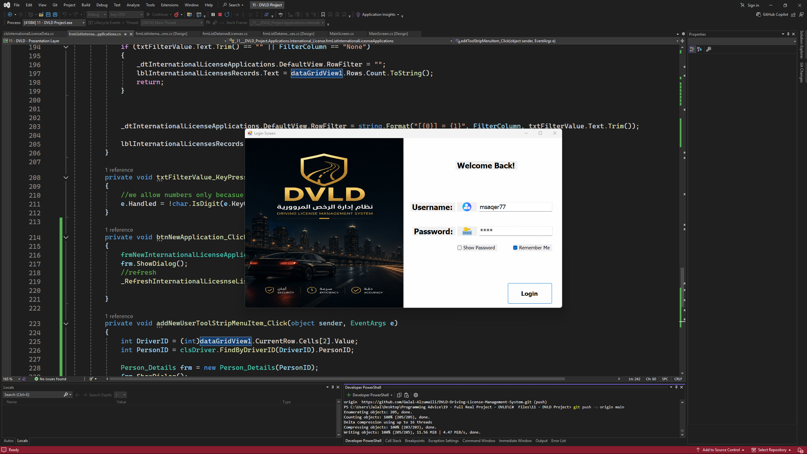
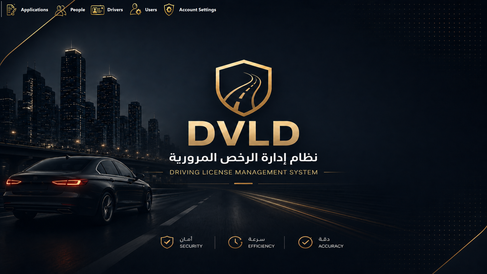
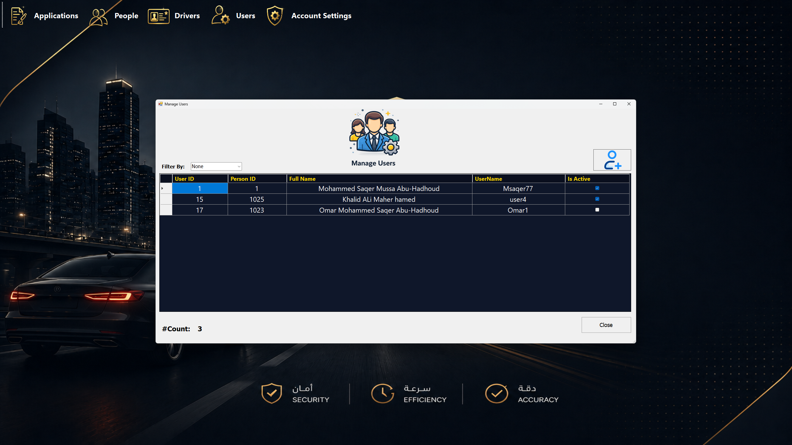
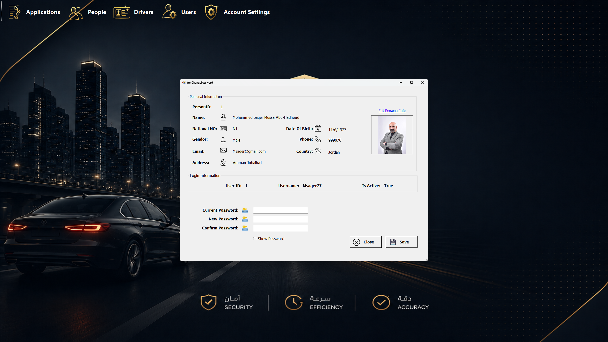
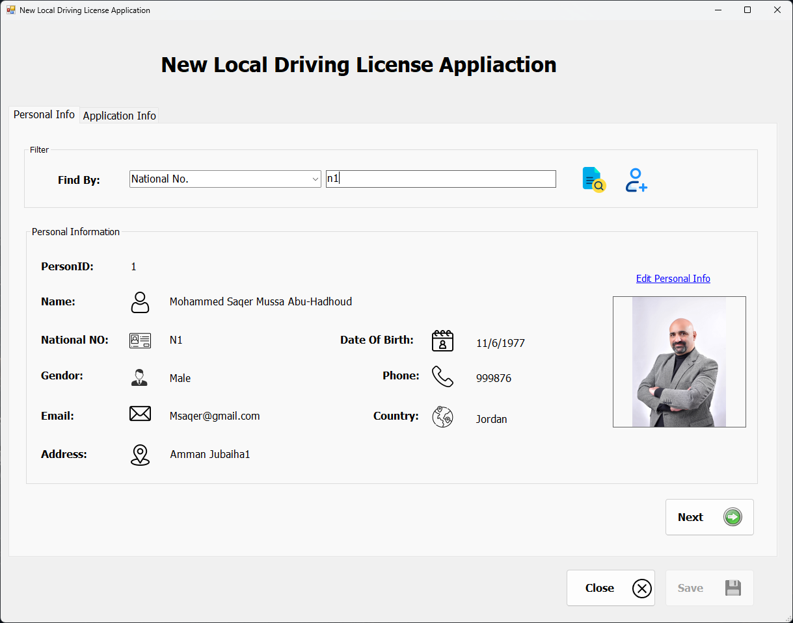
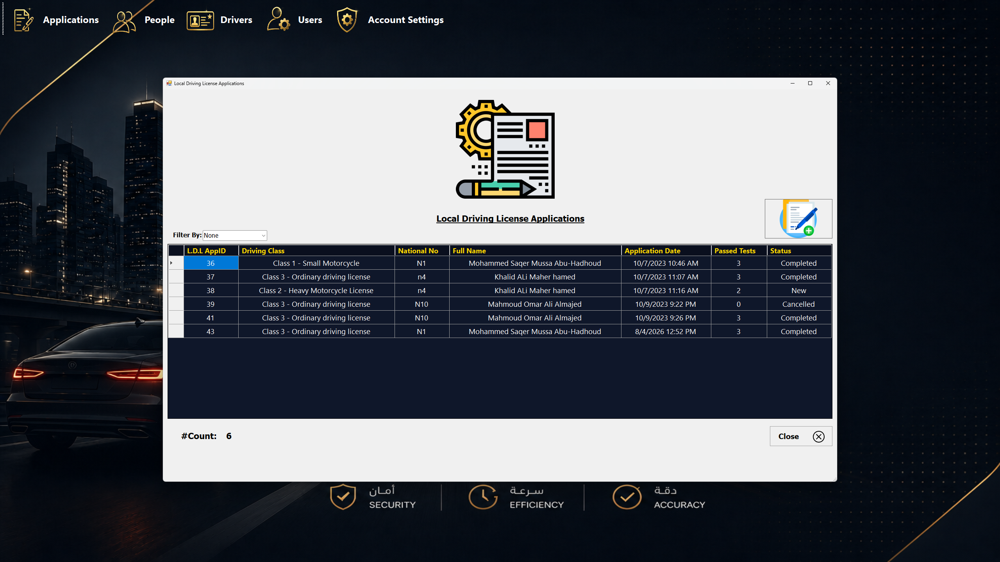

# DVLD – Driving License Management System

A desktop application built with **.NET (WinForms)** that simulates a real-world **Department of Vehicle and Driving Licenses (DVLD)** system. It manages the full lifecycle of driving licenses — from applicant registration and testing, to issuing, renewing, replacing, and detaining licenses — following a clean **3-Tier Architecture**.

This project was built as a hands-on exercise to apply solid software architecture principles (separation of concerns, layered design) to a real, business-heavy domain rather than a simple CRUD demo. It took roughly **3–4 months** to design and build.

---

## 📋 Table of Contents

- [Overview](#-overview)
- [Features](#-features)
- [Architecture](#-architecture)
- [Tech Stack](#-tech-stack)
- [Project Structure](#-project-structure)
- [Getting Started](#-getting-started)
- [Database Setup](#-database-setup)
- [Screenshots](#-screenshots)
- [Future Improvements](#-future-improvements)
- [License](#-license)

---

## 🧭 Overview

DVLD is a Windows Forms desktop application that models the core operations of a driving license authority. It covers people/applicant management, driving tests, license issuance (local & international), license renewal/replacement, license detention/release, user accounts, and system audit logging — all backed by a normalized SQL Server database and accessed through a hand-written ADO.NET data layer (no ORM), giving full control over queries, stored procedures, and transactions.

## ✨ Features

**Applicants & People**
- Add, search, and update person records (national ID, contact info, address, etc.)
- Attach and manage applicant photos/documents

**Driving Tests**
- Schedule and manage test appointments: Vision Test, Written Test, and Practical (Road) Test
- Record pass/fail results and enforce test-order/eligibility rules before issuing a license

**License Management**
- Issue a new **local** driving license
- Issue a new **international** driving license
- Renew an existing license
- Replace a lost or damaged license
- Detain a license (e.g., due to violations) and release it later
- Track license history and status per driver

**Applications Workflow**
- Create and track license applications (new license, renewal, replacement, international) with status and fees

**Users & Security**
- User accounts with role-based access
- Passwords are hashed before being stored in the database
- Login/authentication screen

<<<<<<< HEAD
**Reports**
- Generate reports (e.g., licenses issued, applicants, tests) for record-keeping

> 💡 Adjust this list to exactly match the modules you implemented (e.g., if traffic violations or printable license cards are included).
=======

>>>>>>> 9827e6d5c508c17438f8e5bfdec5c649b723ec80

## 🏗 Architecture

The system follows a classic **3-Tier Architecture**, keeping each layer independent and replaceable:

<<<<<<< HEAD
```
=======

>>>>>>> 9827e6d5c508c17438f8e5bfdec5c649b723ec80
┌───────────────────────────┐
│   Presentation Layer       │  → WinForms UI (11 - DVLD Project)
├───────────────────────────┤
│   Business Logic Layer     │  → Validation & business rules (DVLD - Business Layer)
├───────────────────────────┤
│   Data Access Layer         │  → ADO.NET + Stored Procedures (DVLD - Dataccess Layer)
├───────────────────────────┤
│   SQL Server Database       │
└───────────────────────────┘
<<<<<<< HEAD
```
=======

>>>>>>> 9827e6d5c508c17438f8e5bfdec5c649b723ec80

- **Presentation Layer** – WinForms UI responsible only for user interaction and displaying data.
- **Business Layer** – Encapsulates business rules, validation, and workflow logic (e.g., a person can't get a license without passing all required tests).
- **Data Access Layer** – Handles all communication with SQL Server via ADO.NET and stored procedures, isolating SQL from the rest of the application.

This separation makes the codebase easier to maintain, test, and extend — for example, the UI could be swapped for a web front-end without touching the business or data layers.

## 🛠 Tech Stack

| Layer            | Technology                     |
|-------------------|----------------------------------|
| UI                | Windows Forms (.NET, C#)        |
| Business Logic    | C# (Class Library)              |
| Data Access       | ADO.NET, Stored Procedures      |
| Database          | Microsoft SQL Server            |
| Architecture      | 3-Tier Architecture             |

## 📁 Project Structure


## 🚀 Getting Started

### Prerequisites

- Visual Studio 2019/2022 (or later)
- .NET Framework (see the project's target framework in Visual Studio)
- Microsoft SQL Server (Express or higher) + SQL Server Management Studio (SSMS)

### Installation

1. **Clone the repository**
   ```bash
   git clone https://github.com/Galal-Alzumaili/DVLD-Driving-License-Management-System.git
   ```
2. **Open the solution**
   - Open `11 - DVLD Project.sln` in Visual Studio.
3. **Restore/set up the database** (see [Database Setup](#-database-setup) below).
4. **Update the connection string**
   - Locate the connection string (typically in the Data Access Layer or an `App.config` file) and point it to your local SQL Server instance.
5. **Build and run**
   - Set `11 - DVLD Project` as the startup project and press `F5`.

## 🗄 Database Setup

1. Open **SQL Server Management Studio (SSMS)**.
2. Create a new database (e.g., `DVLD`).
<<<<<<< HEAD
3. Run the provided database script (`.sql` file) to create tables, stored procedures, and seed data.
   > If you haven't added a `.sql` script to the repo yet, consider exporting your schema (Tasks → Generate Scripts in SSMS) and committing it under a `Database/` folder so others can set up the project easily.
4. Update the connection string in the app to match your server name and database name.

## 🖼 Screenshots

> Add screenshots of the main screens (login, applicant search, issue license, test appointments, etc.) here to give visitors a quick visual overview of the app.

```


```
=======
3. Update the connection string in the app to match your server name and database name.

## 🖼 Screenshots














>>>>>>> 9827e6d5c508c17438f8e5bfdec5c649b723ec80

## 🔮 Future Improvements

- Add unit tests for the Business Layer
- Migrate the Data Access Layer to use an ORM (e.g., Entity Framework) or Dapper
- Add a reporting module with exportable PDF/Excel reports
- Consider a web-based version (ASP.NET Core) for remote access

## 📄 License

This project is open source. Feel free to use it for learning purposes.  
*(Add your preferred license, e.g., MIT, or state "All rights reserved" if you'd rather keep it closed.)*

---

**Author:** [Galal Alzumaili](https://github.com/Galal-Alzumaili)
